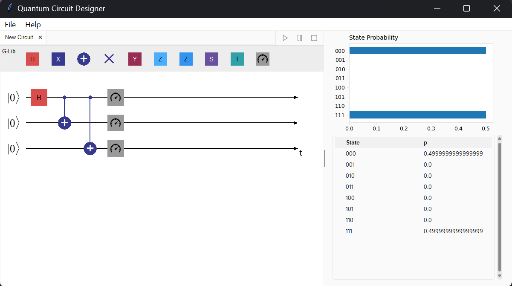

# Quantum Circuit Designer ⚛️🖥️

User-friendly drag-and-drop PoC application that allows you to design and "simulate"/evaluate the "execution results" of Quantum Circuits.





## 📄 Paper: `Understanding and Simulating Quantum Circuits`
This project currently comes coupled with [an introductory paper](./doc/Understanding_and_Simulating_Quantum_Circuits.pdf) which — while not particularly achieving anything revolutionary — could serve as a pretty nice, beginner-friendly introduction to **Quantum Algorithms** (& **Quantum Circuits**) and the current state of this technology, as well as its (potential & future) value, particularly from the point of view of somebody who has a generalist Software Engineering background.

### "TL;DR" (kind of)
Quantum algorithms are essentially series of ordered special matrix operations, where we limit ourselves to the "types" of matrices that are allowed to be used (because by doing so, we get to work with very useful properties).

A bunch of special (and scary-looking) notation is used to describe the matrices/vectors & operations (think stuff like `|φ>`, `|001>` `|0>|1>`, `|01> ⊗ H₂` etc.), which ultimately all comes down to being shorthand to represent arrays/vectors & matrix multiplications and matrix operations (linear algebra) — multiplying rows by columns etc. You can do quantum algorithms without this notation, but you'd be writing some very ugly matrices and arrays containing mostly `0`'s everywhere if you did.

To summarise what goes into a "quantum algorithm":


- The **input** of a quantum algorithm is a vector of some length `2^N`, where typically all elements are `0` and one element is `1`. You can understand this as a 100% probability of "`being in state <array index of the '1'>`"
- We perform **operations** on the input by multiplying it with **special matrices**. The matrices we multiply by represent manipulations in the probability of states. The "special property" of these matrices is that they are reversible ("[unitary](https://en.wikipedia.org/wiki/Unitary_matrix)") which means that after you use them in your multiplication, the result still represents a valid probability distribution! The matrices/operations are also known as "**gates**".
- The **output** of a quantum algorithm is a vector of the same length `2^N`. It again represents a probability, however in this case the probability will not necessarily be a `100% chance of being in state <array index of the '1'>` anymore — it is generally useful to have a probabilistic result of multiple potential values!

Quantum algorithms are an extension of probability theory, except in quantum algorithms we also work with imaginary numbers (this is the unique thing about quantum algorithms — this is what gives them their power!), which requires encoding probabilities in a specific way: to get the probability of "`being in state <index of the item>`" you decode it by taking the absolute (then) squared value — that is: `abs(output_array[index])**2`.

This "absolute squared value" "encoding" comes from quantum mechanics.

In practice, the theoretical **output** described above represents: "if I read out ('measure') the value of my qubits after applying these operations, `abs(output_array[index])**2` is the probability that I will find them to be in binary value `<index as a binary number>` when I read them out".
In other words, if you actually execute your algorithm on a quantum computer/chip, you will get a **binary** result, and which one you get depends on the probability distribution described by the **output**. However, if you repeat the process of setting up the input + operations + reading-out multiple times, you will be able to reconstruct the probability distribution vector of the **output**.


Quantum algorithms try to accomplish interesting and useful things with this mechanism, which in a lot of cases allows them to accomplish *more things in less steps*. Here, steps are interpreted in the Big-Oh sense, but where one matrix multiplication is just a single step in a quantum computer/chip!


#### If it's just multiplying matrices... then why the diagram?

The diagram — called a "Quantum Circuit" — is a shorthand for representing the ordered matrix operations. It is useful because the vectors and matrices used in useful quantum algorithms are exponential in size (`2^N` input & output vector, `2^N * 2^N` operation matrices).

The quantum circuit diagram was thought up as a way to focus on `what kind of operation` is being applied to `which qubit` ("quantum bit") `at which time aka in which order`. In some cases, a matrix would only affect (the value of) a single qubit — which is quite clearly reflected in this type of diagram (e.g. check out the `H` box in the screenshot above). In other cases, two or more qubits are affected, where the **vertical lines** reflect which qubits are being affected/involved in the operation (check out the `+` element with it's extension line going up).

As mentioned, quantum algorithms are specifically ordered matrix operations, and hence, the diagram is read from left-to-right (I believe the concept was inspired by [musical notation](https://en.wikipedia.org/wiki/Musical_notation)).

Going back to the UI-screenshot at the top of this README:

- The initial value of the qubits are shown at the very left, and in a standard quantum algorithm this is either `0` or `1` for each qubit (you'll actually regularly find them all set to `0`, mostly because it's very easy to toggle that `0` to a `1` by using the `X`/`NOT` gate).
    In the screenshot above:
    - all of them are `|0>`
    - aka all qubits are initialised as `0`
    - aka the input is the binary string `000`
    - aka the input-vector is `[1, 0, 0, 0, 0, 0, 0, 0]`

- The rows give the operations applicable to the qubits in order. E.g. the top horizontal line describes the operations applicable to the first qubit:
    1. First we apply a `H` "[Hadamard gate](https://en.wikipedia.org/wiki/Hadamard_matrix)"
    2. Then we apply two `+` "[Controlled/Conditional NOT gate](https://en.wikipedia.org/wiki/Controlled_NOT_gate)" in *two separate steps*, which involve the second (from the top) and the third (from the top) qubits respectively.
- The output needs to be computed, and in the UI above the computation-result is shown in the right-sidebar (these are the aforementioned "`absolute squared value at <index>`").
    - There is a probability of `0.5` of reading out a `000` when we execute this algorithm on a real quantum chip
    - And also a probability of `0.5` of reading out `111`

### Conclusion

For a more comprehensive overview, I'd point you towards the paper (it's 10 pages and has a bunch of pictures 😃!) and/or some of the reference books linked to in the references list of the paper.

You will need to know Linear Algebra, but it's not really anything too radical/complex once you remember what mathematical notation/symbol represents what operation.

----------------

## Note from author

The original project work is currently paused, but I thought it might be neat to share a copy of this publicly for now & its current state.

I figured it's also a nice demonstration of me doing something non-standard generalist software engineering 😅

## Dev Implementation Notes


The initial design idea was to limit the # of dependencies to be as close to base-Python as possible (hence this is written as a TKinter app, even though that's not necessarily an... _ideal_... framework for UI stuff) and mostly avoid any Javascript (not everybody was familiar/comfortable with Javascript or its derivatives like TS) and allow easy reuse of the python classes/code in other projects/modules.

Though, after implementing it like this, there's an argument to be made that a more performant and better documented UI framework should have been used, which would have allowed a smoother and better-looking diagramming UI experience -- possibly not rendering UI on the CPU like TKinter does. But this would likely require decoupling the UI from the "backend" (the place that does all the matrix math), which we want(ed) to be in Python. Possibly introducing Javascript anyway (or some other non-Python language).

Given the project is paused for now, I am leaving this as an open question.


-----------------------------

### Installation (Development)

#### Requirements
1. A local installation of [Python 3.11](https://www.python.org/downloads/)+ & `pip` package manager
2. `pip` install the dependencies in [`./src/requirements.txt`](./src/requirements.txt).
    - E.g. follow [this VSCode guide](https://code.visualstudio.com/docs/python/environments#_create-a-virtual-environment-in-the-terminal) which includes command-line-only instructions.
    - Or use an editor with support like [Visual Studio Code](https://code.visualstudio.com/Download) with Python extensions or [PyCharm](https://www.jetbrains.com/pycharm/)
3. Download [Ghostscript](https://ghostscript.com/releases/gsdnld.html) and add to your `PATH` to enable exporting circuits to images from the UI
4. Run the UI using your IDE/editor or from the root dir from the command line:
```shell
python ./src/ui/main.py
```

The above set of instructions is verified to work with:
- `.venv` and Visual Studio Code "run" button
- PyCharm
- `.venv` and running the UI from the command line

-----------------

### Credits

##### "play"/"pause"/"stop" icons UI (modified assets):
Vectors and icons by [Catalin Fertu](https://dribbble.com/catalinfertu?ref=svgrepo.com) ("Bigmug Interface Icons") in CC Attribution License via [SVG Repo](https://www.svgrepo.com/)

##### "measure" icon in UI (modified assets):
Designed by [Freepik](www.freepik.com) (CC Attribution License)

-----------------

## WIP:


- More tests

Potential problems that are not necessarily real problems:

- Documentation for the gates (on hover in the toolbar) are placeholders
  - Intended as of right now

### Downloads

TODO: make some .exes for windows and mac (and linux while we are at it).