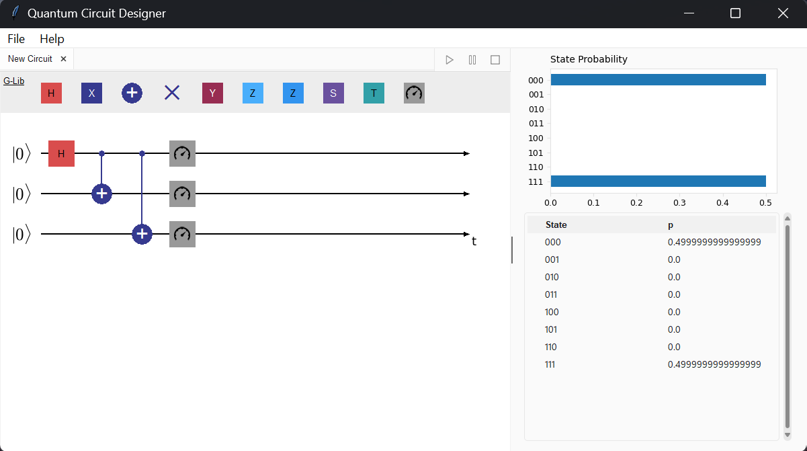

# Quantum Circuit Designer & Simulator




An interactive, purely functional quantum circuit prototyping tool and simulation backend built for real-world physics lab environments (specifically targeting NV-center qubit experiments).

## System Architecture
Unlike standard educational visualizers, this tool was engineered to compute the underlying linear algebra of quantum state evolution, providing a robust bridge between high-level circuit design and low-level matrix mechanics.

* **Unitary Transformation Engine:** Dynamically compiles sequential and concurrent gate applications into system-level unitary matrices ($U^\dagger U = I$), ensuring strict adherence to the normalization constraint across deep circuits.
* **Pure State Simulation Backend:** Executes state-vector propagation for multi-qubit systems, natively handling entanglement (e.g., Bell State generation) and interference without classical approximation.
* **Dynamic Controlled Operations:** Implements algorithmic decomposition for $n$-qubit controlled gates, computing $M_{q_j=|0\rangle}$ and $M_{q_j=|1\rangle}$ conditionally to apply transformations without rank-collapse.

## Extensibility: The NISQ Roadmap
The core engine was architected with a modular state-representation layer. While currently optimized for pure-state vectors ($|\psi\rangle$), the data structures are designed to be extended into the **Density Matrix ($\rho$)** formalism to support:
* **Mixed-State Evolution**
* **Kraus Operator / Decoherence Modeling**
* **Custom Pulse-Level Control Sequences**

## Tech Stack
* **Language:** Python 3 (Scientific Stack)
* **Design Pattern:** Decoupled interactive GUI / Mathematical Backend

-----------------------------

### Installation (Development)

#### Requirements
1. A local installation of [Python 3.11](https://www.python.org/downloads/)+ & `pip` package manager
2. `pip` install the dependencies in [`./src/requirements.txt`](./src/requirements.txt).
    - E.g. follow [this VSCode guide](https://code.visualstudio.com/docs/python/environments#_create-a-virtual-environment-in-the-terminal) which includes command-line-only instructions.
    - Or use an editor with support like [Visual Studio Code](https://code.visualstudio.com/Download) with Python extensions or [PyCharm](https://www.jetbrains.com/pycharm/)
3. Download [Ghostscript](https://ghostscript.com/releases/gsdnld.html) and add to your `PATH` to enable exporting circuits to images from the UI
4. Run the UI using your IDE/editor or from the root dir from the command line:
```shell
python ./src/ui/main.py
```

The above set of instructions is verified to work with:
- `.venv` and Visual Studio Code "run" button
- PyCharm
- `.venv` and running the UI from the command line

-----------------

### Credits

##### "play"/"pause"/"stop" icons UI (modified assets):
Vectors and icons by [Catalin Fertu](https://dribbble.com/catalinfertu?ref=svgrepo.com) ("Bigmug Interface Icons") in CC Attribution License via [SVG Repo](https://www.svgrepo.com/)

##### "measure" icon in UI (modified assets):
Designed by [Freepik](www.freepik.com) (CC Attribution License)

-----------------

## WIP:


- More tests

Potential problems that are not necessarily real problems:

- Documentation for the gates (on hover in the toolbar) are placeholders
  - Intended as of right now

### Downloads

TODO: make some .exes for windows and mac (and linux while we are at it).